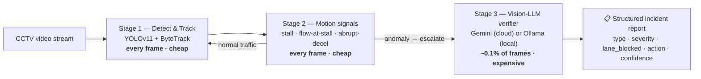
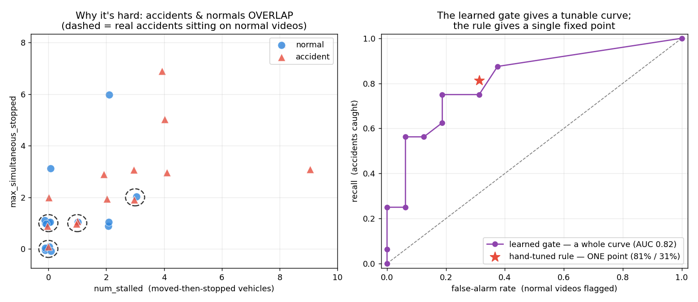

# 🚦 SentryEye — Budget-Aware Traffic-Incident Detection

**Detect traffic accidents from CCTV video in real time, and call an expensive vision-LLM on only ~0.1% of frames.**


SentryEye watches a traffic-camera feed and raises **structured, dispatcher-ready incident reports** — *what* happened, *how severe*, *is a lane blocked*, *what to do* — the moment something goes wrong. The core idea is a **cheap→expensive cascade**: fast models run on every frame; a heavyweight vision-LLM is invoked only when a cheap signal says "look here." The result is accident detection at a tiny fraction of the compute a naive "run the big model on every frame" system would burn.

> Built to extend edge-based traffic-monitoring research ([STREETS](https://github.com/streets-semantic-resource-management) / adaptive frame-skipping) toward *value-aware* computation: spend expensive inference only when it changes the decision.

---

## 💡 Why this design

Running a vision-LLM on every frame of every camera is accurate but absurdly expensive — and 99.9% of frames are just normal traffic. SentryEye splits the work by cost:

- **Cheap stages** (object detection + motion heuristics) watch **100% of frames** for almost nothing.
- **The expensive stage** (a vision-LLM) is the *precision* layer — it only runs when a cheap signal escalates, and it makes the final call.

This "cheap filter → expensive verifier" pattern is what keeps the system affordable enough to imagine running on cheap edge hardware, one of the open problems in the space.

---

## 🏗️ Architecture



| Stage | Job | Cost | Runs on |
|-------|-----|------|---------|
| **1 — Detect & track** | Find and ID vehicles across frames (YOLOv11 + ByteTrack) | cheap | every frame |
| **2 — Motion signals** | Flag anomalies: moved-then-stalled, stopped-while-others-flow, abrupt deceleration | cheap | every frame |
| **3 — Vision-LLM verifier** | Look at the flagged frame, decide if it's a real incident, write a typed report | expensive | only on escalation |

---

## 📊 Results (evaluated on the [TAD benchmark](https://github.com/yajunbaby/A-Large-scale-benchmark-for-traffic-accidents-detection-from-video-surveillance) — real CCTV accident footage)

| What | Result |
|------|--------|
| **Vision-LLM invocations vs. run-every-frame** | **~0.1% of frames — a ~99% reduction** |
| Cheap-gate detection on 32 real test videos | **81% recall @ 31% false-alarm** (baseline single rule) |
| Vision-LLM on a real crash frame | `collision`, severity `high`, lane_blocked, **conf 0.98** ✅ |
| Vision-LLM on normal traffic | `none`, **conf 0.95** ✅ (stays quiet — no false alarm) |
| Hardest case (a normal clip statistically identical to real accidents at the gate) | **correctly rejected** by the verifier ✅ |



**An honest engineering finding.** I tried replacing the hand-tuned escalation rule with a *learned* gate. With proper train/test discipline it did **not** robustly beat the tuned rule — several real accidents are statistically identical to normal congestion in aggregate motion features (a *feature* ceiling, not a *model* ceiling). Feature selection did matter: trimming 6 features to the 2 informative ones lifted ROC-AUC from **0.70 → 0.82**. The takeaway that shaped the design: **the vision-LLM is the precision stage**, so the cheap gate only needs high *recall* at a low call-budget — the verifier removes its false alarms.

---

## ⚙️ How the pieces map to code

```
app/
├── detect.py        # Stage 1: YOLOv11 + ByteTrack detection & tracking
├── signals.py       # Stage 2: per-vehicle motion anomaly signals (stall, etc.)
├── report.py        # Stage 3: vision-LLM verifier → typed Pydantic IncidentReport
│                    #          provider-agnostic (Gemini cloud OR Ollama local),
│                    #          with retry-on-transient-error backoff
├── cascade.py       # the full 3-stage cascade on a single video
├── eval_gate.py     # feature extraction + baseline-gate scoring over a dataset split
├── train_gate.py    # learned-gate experiment (LogReg) + honest evaluation
├── eval_system.py   # end-to-end cascade evaluation (resumable, cached)
├── read_video.py    # OpenCV video/frame-sequence reader
└── check_env.py     # environment sanity check (versions, MPS availability)
```

The incident report is a typed contract, not free text:

```python
class IncidentReport(BaseModel):
    incident_type: str        # none | stalled_vehicle | collision | debris | wrong_way | congestion
    severity: str             # none | low | medium | high
    vehicles_involved: int
    lane_blocked: bool
    description: str
    recommended_action: str
    confidence: float
```

---

## 🚀 Quickstart

```bash
# 1. Install (Python 3.12 recommended)
python -m venv .venv && source .venv/bin/activate
pip install -r requirements.txt

# 2. Choose your vision-LLM backend
#    a) Cloud (Gemini): put your key in .env
echo "GOOGLE_API_KEY=your_key_here" > .env
#    b) OR fully local/offline (Ollama): pull a vision model, then set the env var
#       ollama pull llama3.2-vision
#       export VLM_PROVIDER=ollama

# 3. Run the full cascade on a video
python -m app.cascade path/to/traffic_video.mp4

# 4. Verify a single frame
python -m app.report path/to/frame.jpg

# 5. Reproduce the evaluation (needs the TAD benchmark)
python -m app.eval_gate   /path/to/TAD/test   --out data/test_features.csv
python -m app.eval_system /path/to/TAD/test
```

**Datasets** (not committed — large): [TAD](https://github.com/yajunbaby/A-Large-scale-benchmark-for-traffic-accidents-detection-from-video-surveillance) (accident CCTV) and [UA-DETRAC](https://detrac-db.rit.albany.edu/) (normal traffic).

---

## 🧰 Tech stack

**Python** · **PyTorch** (Apple-MPS accelerated) · **Ultralytics YOLOv11** · **ByteTrack** · **OpenCV** · **scikit-learn** · **Google Gemini API** · **Ollama** (local VLM) · **Pydantic** · **pandas / matplotlib** · **Docker** · **Git**

---

## 🗺️ Roadmap

- [x] 3-stage cascade (detect → signals → vision-LLM) end to end
- [x] Structured incident reports (Pydantic + Gemini/Ollama)
- [x] Evaluation on real accident data (TAD) with train/test discipline
- [x] Provider-agnostic, fault-tolerant, resumable pipeline
- [ ] **Real-time serving demo** — FastAPI + WebSockets, live annotated stream
- [ ] Full end-to-end benchmark sweep + time-to-detection / Pareto (cost vs. detection) curves
- [ ] Edge deployment target (Jetson Orin Nano / Raspberry Pi + NPU)

---

## 📚 Background

Extends the author's research on adaptive, resource-aware video pipelines (the **STREETS** NSF project and **SkipComp** frame-skipping work at GWU) toward learned, budget-aware escalation — spending expensive computation only when it changes the outcome.

## 📄 License

MIT — see [LICENSE](LICENSE).
